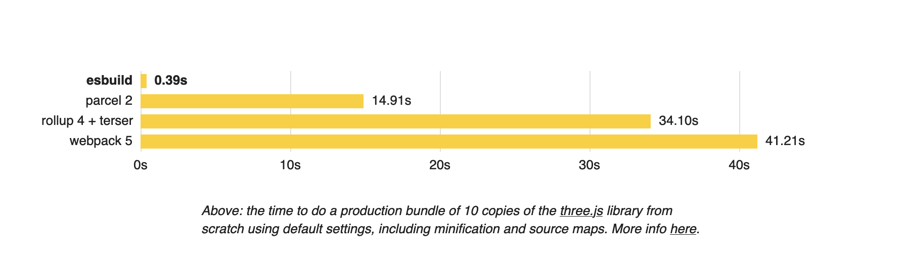
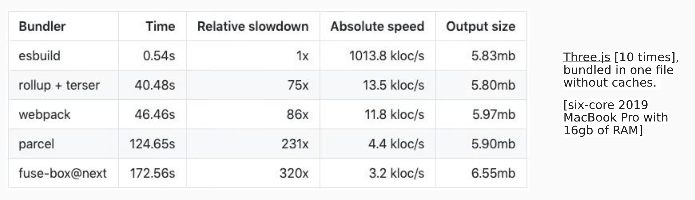

## Fundamental of Esbuild ✨

- Extremely fast bundler for the web


- Esbuild bundler project is to bring about a new era of build tool performance, and 
create an easy-to-use modern bundler along the way.

- Speed comparison


### Where is this speed coming from?

- It’s written in GO and compiles to a native code.
    - Other bundlers are mostly written in JavaScript, and none of them compiles to native code. they run via the command line in the node environment.
- Parallelism is used heavily
    - Javascript parallelism was not there before but it's now available in nodes by the means of worker threads now.
    - Go parallelism is better than javascript because it can share the memory across all the threads which javascript cannot do today. Javascript has to serialize the data between the thread, hence esbuild which is written in GO is faster.
- Everything in esbuild is written from scratch.
    - All the bundlers which are there in the market use TS bundler ( the official typescript loader ) but esbuild has written its own parser and everything from scratch.
    - It also doesn’t add packages via npm as compared to other bundlers
- Memory is used efficiently
    - It has to go AST ( Abstract syntax tree ) only thrice where others take more iteration over the AST.

### Major features

- Extreme speed without needing a cache.
- JavaScript, CSS, TypeScript, and JSX built-in.
- A straightforward API for CLI, JS, and Go.
    - Just provide an input and output file in the command line to bundle the file it via esbuild CLI
- Bundles ESM and common JS ( Require.js ) modules
- Tree shaking, minification, and source maps
- **Vite uses esbuild** to transpile TypeScript into JavaScript which is about 20~30x faster 
than vanilla TSC and HMR updates can reflect in the browser in under 50ms.
    - HMR updates refer to Hot Module Replacement updates, which allow developers to update code in real-time without having to reload the entire page or application. This can greatly improve development speed and efficiency.
- For dev build, Vite and Snowpack internally use `esbuild` as a dependency. For prod build, they use roll-up.
    - Note: Esbuild is still used for transpilation and minification in Vite during the build, but bundling is left to Rollup. So build is used for part of the build process.
- Esbuild tranpiles the code to ES6 or above
  - One disadvantage that esbuild has is it does not transpile it to an ES5, as compared to other bundlers such as rollup and webpack

## ESBuild vs SWC Comparsion

Here's a breakdown of esbuild vs SWC:

### Esbuild Advantages

- Blazing Speed: esbuild is known for its exceptional build times, often significantly faster than SWC, especially for larger projects.

- Bundling: esbuild is a bundler, meaning it can take multiple files and combine them into a single optimized file for efficient browser loading. SWC has limited bundling capabilities.

- Simplicity: esbuild has a straightforward configuration, making it easier to get started with for basic bundling and minification tasks.

### Esbuild Disadvantages

**Limited Configurability**: While simple to use, esbuild offers less flexibility in configuration compared to SWC.

**Compatibility**: esbuild might not support all the latest JavaScript features or transformations that SWC can handle.

### SWC Advantages

**Compatibility**: SWC aims for high compatibility with Babel and TypeScript, making it a good choice for projects relying on a wider range of features.

**Configurability**: SWC offers more extensive configuration options for fine-tuning the compilation process for specific needs.

**Future-Proofing**: Being written in Rust, SWC might benefit from performance improvements as Rust continues to evolve.

### SWC Disadvantages

**Speed**: While fast, SWC generally has slower build times compared to esbuild, especially for larger codebases.

**Bundling**: Requires additional setup for bundling functionalities that esbuild offers out of the box.

### Choosing Between Them:

For speed-critical projects with simple bundling needs, esbuild is a great choice.

If broader feature compatibility, fine-grained control, and future-proofing are priorities, SWC might be a better fit.

## Understand how esbuild as a bundler work? 

**Install Esbuild using npm**

```
$ npm i -D esbuild
```

**Verify the version that got installed**

```bash
$ ./node_modules/esbuild/bin/esbuild --version
0.20.2
```

**Create 3 file**

`Index.js`
```js
import a from "./a";
import b from "./b";

console.log(a + b);
```

`a.js`
```js
const a = "a";

export default a;
```

`b.ts`
```ts
let b: string="b";
export default b;
```

**Run the esbuild with the entry file**

```bash
$ npx esbuild --bundle src/index.js   
```

**Output to the file**

```bash
$ npx esbuild --bundle src/index.js --outfile=dist/index.js
```

This is w.r.t to the CLI, you also node script, which acts like esbuild configuration file ( like webpack and rollup ) and run it to get the exact output.


**Create a file called `build-with-esbuild.js`**

`build-with-esbuild.js`
```js
const esbuild = require("esbuild");

esbuild.buildSync({
  bundle: true,
  entryPoints: ["src/index.js"],
  outfile: "dist-node/index.js",
});
```

now run the file using `node build-with-esbuild.js`

**Esbuild provide a watch mode to watch for file change**

It automatically build new bundle code whenever the code file changes
```bash
$ npx esbuild --bundle src/index.js --outfile=dist/index.js --watch
```

**How to do using script?**

```js
async function watch() {
  let ctx = await esbuild.context({
      bundle: true,
    entryPoints: ["src/index.js"],
    outfile: "dist-node/index.js"
  });
  await ctx.watch();
  console.log("Watching...");
}

watch();
```

**Minify the final bundl**

```js
async function watch() {
  let ctx = await esbuild.context({
      bundle: true,
    entryPoints: ["src/index.js"],
    outfile: "dist-node/index.js",
    minify: true
  });
  await ctx.watch();
  console.log("Watching...");
}

watch();
```

**Serve bundle fil**

```bash
$ npx esbuild --bundle src/index.js --outfile=dist/index.js --serve
```

Here you can not use serve and watch together. While watch will build the file everytime you will make the changes, but in case of serve it build the file only when you request the file, and serve it for you.

**Generate source map**

```js
async function watch() {
  let ctx = await esbuild.context({
      bundle: true,
    entryPoints: ["src/index.js"],
    outfile: "dist-node/index.js",
    minify: true,
    sourcemap: true
  });
  await ctx.watch();
  console.log("Watching...");
}

watch();
```

**You can also set a target for transpilatio**

```js
async function watch() {
  let ctx = await esbuild.context({
      bundle: true,
    entryPoints: ["src/index.js"],
    outfile: "dist-node/index.js",
    minify: true,
    sourcemap: true,
    target: ["chrome58", "firefox57", "safari11", "edge16"]
  });
  await ctx.watch();
  console.log("Watching...");
}

watch();
```


**You convert a typescript file into javascript fil**

```bash
$ npx esbuild --bundle src/echo.ts --outfile=src/echo.js
```

or 

```bash
$ ./node_modules/.bin/esbuild src/echo.ts --outfile=src/echo.js
```

**You can do this using typescript as wel**

```bash
$ npm i -g typescript
```

```bash
$ tsc src/echo.ts --target es6 --outFile src/echo.js
```

**You can transpile your code into es5 using typescript compiler (tsc**

```bash
$ tsc src/echo.ts --target es5 --outFile src/echo.js
```

**You can check the time it took to convert the typescript code into javascript by TS**

```bash
$ time tsc src/echo.ts --target es6 --outFile src/echo.js
```
it tooks approx 3sec 

But with the esbuild

```bash
$ npx esbuild --bundle src/echo.ts --outfile=src/echo.js
```
it tooks approx 7ms

